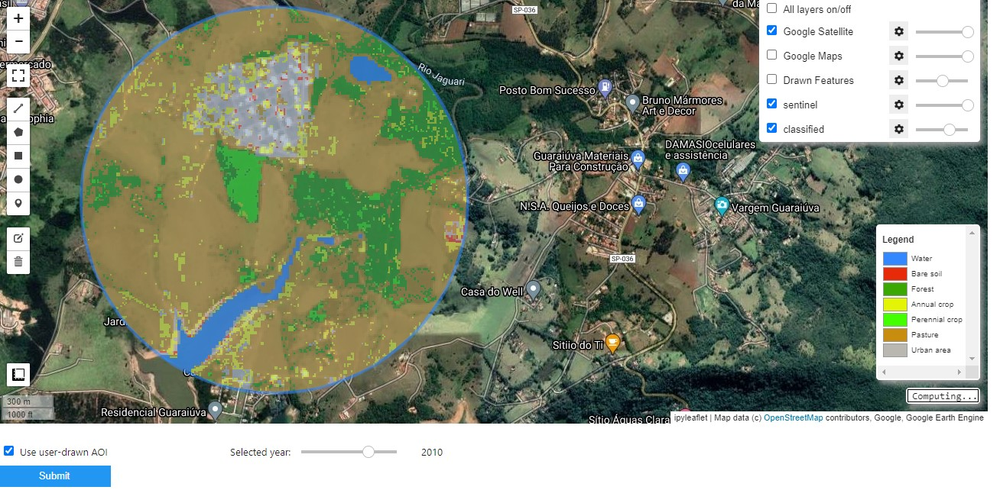

# LULC_app

Classify Land Use Land Cover in Brazil with Machine Learning

## Instructions

## Development

The app uses a Classification Tree algorithm to predict landcover from Sentinel-2 image
To train the model data was colected as described on the 'retrieve_data' notebook.
The modeling step can be found on notebook/modeling.ipynb

* warning: This is a in progress project and there are improvements in the modeling process that are needed for a reliable result.

## Credits
Sentinel images
geemap 

